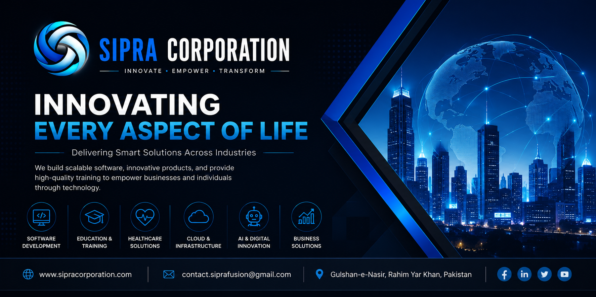
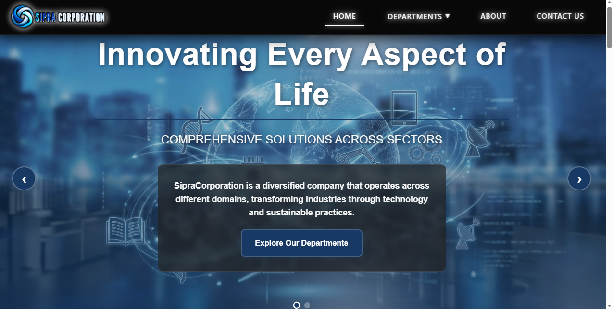
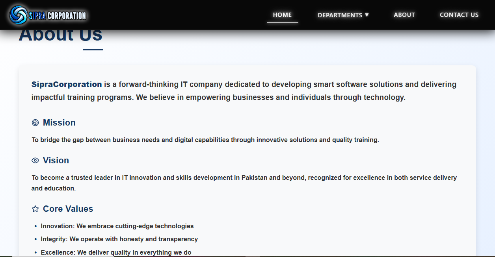
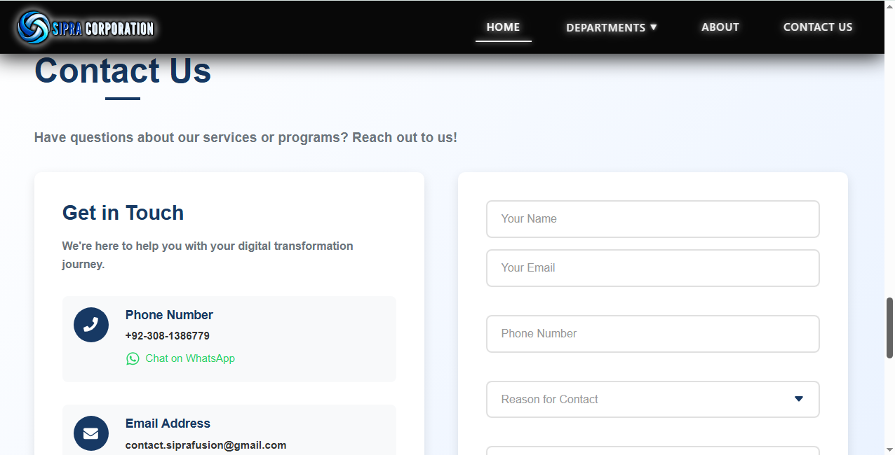

# 🏢 Sipra Corporation Website

<p align="center">
  
</p>

<p align="center">
Modern • Enterprise • Scalable • Professional Software Company Website
</p>

---

# 📖 Overview

The **Sipra Corporation Website** is the official corporate website of **Sipra Corporation**, showcasing our software development expertise, enterprise solutions, digital transformation services, and innovative technology products.

The platform highlights our services, portfolio, technologies, products, and contact information through a modern responsive interface designed for businesses worldwide.

---

# ✨ Key Features

- Responsive Corporate Website
- Modern UI/UX Design
- Company Portfolio
- Service Showcase
- Technology Stack Display
- Products Showcase
- Contact Form
- Career Information
- Mobile Friendly
- SEO Optimized
- Fast Performance
- Secure Architecture

---

# 💻 Technology Stack

| Layer | Technologies |
|--------|--------------|
| Frontend | HTML5, CSS3, JavaScript, Bootstrap, React |
| Backend | ASP.NET Core |
| Database | Microsoft SQL Server |
| API | REST API |
| Hosting | IIS / Windows Server |
| Version Control | Git & GitHub |

---

# 🏗️ Architecture

```
Users
   │
   ▼
Responsive Frontend
   │
REST APIs
   │
ASP.NET Core Backend
   │
Business Logic
   │
SQL Server Database
```

---

# 🚀 Services

- Enterprise Software Development
- Web Development
- Mobile App Development
- ERP Solutions
- CRM Solutions
- HRMS Development
- School Management Systems
- AI Solutions
- Cloud Solutions
- UI/UX Design
- Database Design
- API Development
- Digital Transformation
- Technical Consulting

---

# 📂 Project Structure

```
SipraCorporationWebsite
│
├── Controllers
├── Models
├── Views
├── Services
├── Assets
├── Scripts
├── Styles
├── README.md
└── LICENSE
```

---

# ⚙️ Installation

Clone the repository

```bash
git clone https://github.com/SipraCorporation/sipracorporation-website.git
```

Restore dependencies

Run the application

Configure SQL Server connection string

Launch the website

---

# 🚀 Deployment

- IIS
- ASP.NET Runtime
- SQL Server
- Windows Server

---

# 🔒 Security

- HTTPS Enabled
- Input Validation
- Authentication
- Authorization
- SQL Injection Protection
- XSS Protection
- Secure Configuration

---

# 📸 Application Screenshots

## 🏠 Home

<p align="center">

</p>

---

## 🚀 Services

<p align="center">

</p>

---

## 🏢 About

<p align="center">

</p>

---

## 💻 Technologies

<p align="center">

</p>

---

## 📁 Portfolio

<p align="center">

</p>

---

## 📞 Contact

<p align="center">

</p>

---

## 🦶 Footer

<p align="center">

</p>

---

# 🔗 Quick Links

- 🌐 **Website:** https://sipracorporation.com
- 💼 **LinkedIn:** https://linkedin.com/in/ahsan-sipra
- 📧 **Email:** ahsan@sipracorporation.com

---

# 📄 License

This project is licensed under the MIT License.

---

# 🤝 Contributing

Contributions are welcome.

Please submit a Pull Request after discussing major changes.

---

# 🔐 Security Policy

Please report vulnerabilities privately.

**Email:** security@sipracorporation.com

---

# 📜 Code of Conduct

- Be respectful
- Be professional
- Encourage collaboration

---

# 📈 Changelog

## Version 1.0.0

- Corporate Website
- Service Showcase
- Portfolio
- Contact Form
- Responsive Design

---

# 🔒 Source Code Notice

The application source code is private because it contains proprietary business logic and commercial components developed by **Sipra Corporation**.

This repository is intended to showcase the project's architecture, features, technology stack, and documentation.

---

# 📬 Contact

**Website:** https://sipracorporation.com

**Company:** Sipra Corporation

**LinkedIn:** https://linkedin.com/in/ahsan-sipra

**Email:** ahsan@sipracorporation.com
